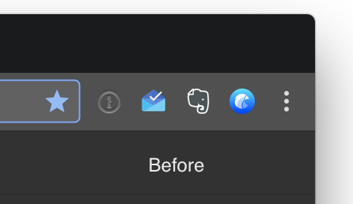
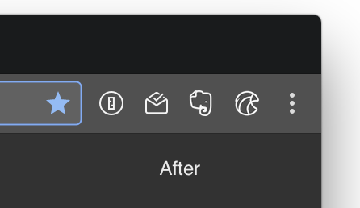
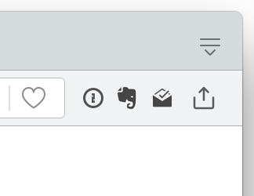
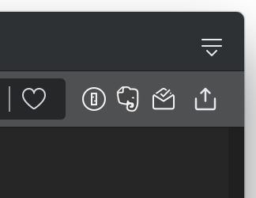

# Chrome and Opera Extention Icons, Rebuilded

## Features

### Consistent icon style




### Clear on both light and dark themes




### Fine visual spacing


## Install

```bash
make install
```

The default installation target is set to Chrome and Opera, if you want to install it for another borwser, please specify the extensions directory of that browser with the `TARGET=` option. Example for Opera Developer: `make install TARGET="$HOME/Library/Application Support/com.operasoftware.OperaDeveloper/Extensions"`.

After installing, you'll need to restart the browser or disable and re-enable each extention for the changes to make effect.

> Note: In Chrome, some extension may be mark as "corrupted" and can not be enabled anymore. You can follow [these steps](https://github.com/zetavg/chrome-extension-icons-patch/wiki/Fixing-Chrome’s-"This-extension-may-have-been-corrupted."-Error-After-Patching) to resolve the problem.


## Uninstall

```base
make uninstall
```

The options are same as `make install`.
